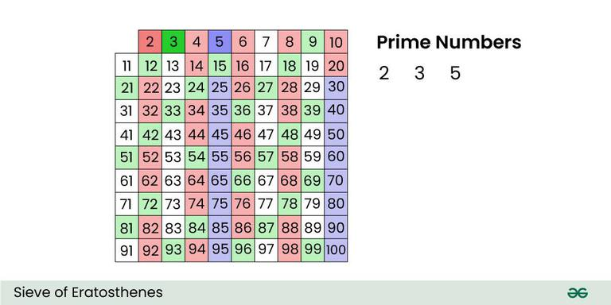

Given a number n, print all primes smaller than or equal to n. It is also given that n is a small number. 
Input : n =10
Output : 2 3 5 7 

Input : n = 20 
Output: 2 3 5 7 11 13 17 19

The sieve of Eratosthenes is one of the most efficient ways to find all primes smaller than n when n is smaller than 10 million or so.

Let us take an example when n = 100. So, we need to print all prime numbers smaller than or equal to 100. 

We create a list of all numbers from 2 to 100.  

According to the algorithm we will mark all the numbers which are divisible by 2 and are greater than or equal to the square of it. 

Now we move to our next unmarked number 3 and mark all the numbers which are multiples of 3 and are greater than or equal to the square of it.  

We move to our next unmarked number 5 and mark all multiples of 5 and are greater than or equal to the square of it. 

We continue this process, and our final table will look like below:

So, the prime numbers are the unmarked ones: 2, 3, 5, 7, 11, 13, 17, 19, 23, 29, 31, 37, 41, 43, 47, 53, 59, 61, 67, 71, 73, 79, 83, 89 and 97.